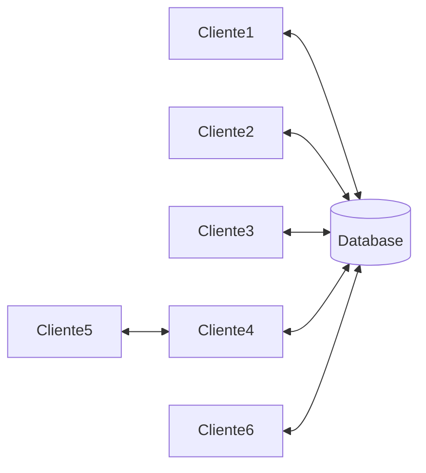

- **_Professor José Prata_** | [Canal](https://youtube.com)
---
# Cadernos
- [[Aula inicial]]
- [[Oracle database no archlinux]]
- [[Módulo DDL]]
- [[Views e Manipulação]]
- [[Funções Nativas]]
# Conteúdo da Disciplina
- Conceitos Gerais, Arquitetura, Exemplo Oracle Instância, Instalação e Configuração
- Projeto de Banco de Dados - Revisão semestre anterior
- Criação, alteração, Eliminação de Tabelas e Implementação das Regras de Integridade
- Comandos DML
- Consultas Básicas e Complexas com SQL
- Criação e Manipulação de Visões
- Procedimentos Armazenados e Funções
- Gatilhos (Trigger)
- Cópia de Segurança e Restauração
- Índices
- Otimização de COnsultas
- Processamento de transações
- Recuperação de Falhas
- Introdução às Novas Tecnologias - Banco de Dados NoSQL

# Metodologia e Avaliação
- Apresentação de conteúdo, Exemplo e Exercicios em laboratórios
- Disponibilzação de material de aula em Arquivos no Teams (Apostila e Vídios)
- Trabalho em grupo
- Avaliação P1
- Avaliação P2 e Recuperação
# Objetivo da Disciplina
- Ao final do curso devemos estar aptos a entender e utilizar:
	- O funcionamento básico de um SGBD, em termos de restrições, garantias, performance, etc.
	- Arquiteturas externas e internas de um determinado SGBD
	- As facilidades que um SGBD propicia
	- As garantias de acuracidade e recuperação de um SGBD
	- A rapidez e capacidade na entrega das informações consultadas.
	- A linguagem de programação padrão para banco de dados relacionais
	- Ferramentas de uso e integração com determinado SGBD
	- Ferramentas de modelagem

---
# Exemplos de SGBDR

- DB2 - IBM
- Oracle - É o que vamos usar nessa aula 
- SQL-Server
- PostgreeSQL
- MySQL
- MariaDB
- Outros
São exemplos de configurações diferentes, mas a ideia da Linguagem, em todas a base é SQL
## Abstração de BD Relaciona
#### Nível Externo:
- Visões externas (consultas) dos usuários finais aos dados
- Ou seja, é a abstração próxima ao usuário do banco de dados, ondem provavelmente haja uma interface para consulta de dados
#### Nível Conceitual
- Esquema conceitual é onde definimos os tipos de tabelas e suas relações
- Esquema interno é a forma de como ele armazena
	- No oracle é dividido o banco de dados em uma tecnologia de contêiner
	- O table space é uma área logica onde contem as tabelas e usuários definidos em uma determinada área. A table space  é uma área que delimita. O mesmo conceito que pode ser chamado de contêiner
- Os arquivos quando abrimos, eles estão fisicamente em algum lugar em minha memória delimitado por ponteiros. Em banco de dados, isso é basicamente a mesma coisa. São ponteiros também que delimitam e gerenciam os armazenamentos
#### Nível Físico:
- Quando crio uma tabela, crio arquivos com extensão .dbfs, que são os arquivos físicos para o banco de dados.
- O esquema físico do banco de dados, é repassado por direcionar que guardão variáveis em memória. Temos alguns comandos que acessam os objetos que estão em determinados dicionários:
- `select username from DBA.users;` - É o comando que procura um determinado usuários no dicionario DBA
- `Select name from DBA_tablespaces` - É o comando que devolve o dicionario com todas as tablespaces que contém em memória
## A.C.I.D
A -> Significa atomicidade
- Isso quer dizer que enquanto faz uma transação no registro, não pode iniciar outra transação. Não pode quebrar uma transação
C -> Significa concistencia
- Isso significa que ele verifica se voce tem o direito de efetuar aquela ação, ve se voce realmente inseriu os dados corretos
I -> Significa Isolamento
- Se o nivel de bloqueio for pessimista, ninguem consegue nem ver a linha. Se o bloqueio for otimista, ai podem ser visualizadas
D -> Significa Durabilidade
- É basicamente o comando commit no banco de dados. Esse comando da a certeza de que os comandos foram consolidados
# A linguagem padrão - SQL
- O sql padrão é a forma mais comum de manipular os dados tradicionais
- há anos, os SGBD's são projetados para executar operações de consulta e carga (que é a inserção de dados) em paralelo.
- Porém o paralelismo está restrita ao mesmo nó. Ou seja, a mesma maquina
# Tipos de arquiteturas
## Centralizada
- Um computador com grande capacidade de processamento, o qual é o hospedeiro do SGBD e emuladores para os vários aplicativos.
- Essa arquitetura tem como vantagem permitir que muitos usuários manipulem grande volumes de dados numa mesma maquina
### **Vantagens**
- Um unico servidor gera alto nivel de segurança, concorrencia e controle de cópias de segurança e recuperação. Não existe a necessidade de junção distribuída já que todos os dados estão em um servidor só
### **Desvantagens**
- Todos os acessos aos dados realizados por outro servidores gera um alto custo de comunicação. Gerando um gargalo, dependendo da quantidade de acessos. Pode até tirar o servidor do ar

---
### **Alguns comandos de Gestão de BD**
- `create users c##aluno identifield by c##aluno default tablespace users quota 30M on users;` 
	- Um comando para criar um usuário `c##aluno` com a senha a mesma, utilizando a tablespace users, que é a tablespace base. E alocamos um espaço de 30 megas para o usuário criado
- `Grant connect resource to c##alunos;`
	- O comando para poder dar a opção ao usuário de abrir conexão com o banco de dados que alocamos anteriormente.