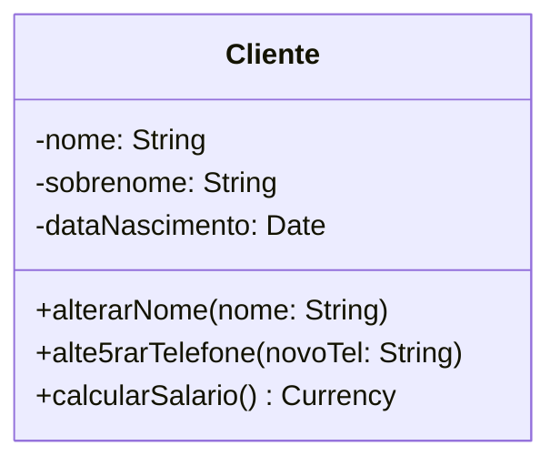

# Introdução ao UML
# Elementos estruturais
## Classe
- Por boas práticas, sempre nomeamos classes com a primeira letra maiúscula
- sinal de menos "-" = private
- sinal de mais "+" = publico
- sinal de hash "#" = restrito
	- Isso tudo está ligado ao escopo da informação

## Objeto
## Nó
## Interface
## Relacionamentos
## Componente
# Conceitos
UML pode ser usado para:
- Mostrar os limites de um sistema e suas principais funções, usando **use cases** e **atores**;
- Ilustra a realização dos use cases, usando os **diagramas de interação**[
- Representa a estrutura estática de um sistema, usando **diagrama de classes)
# Conceitos II
- Modelar o comportamento de objetos, com **diagramas de estados**.
- Apresentar a implementação física e arquitetura de um sistema, co

# Diagramas de Use cases
## Atores
> Atores são pessoas ou coisas que interagem com o sistema em desenvolvimento

- O quadrado que envolve os balões é o limite do sistema
- extend: é quando eu tenho alternativas de fazer uma determinada coisa. Assim eu determino quais as formas de fazer aquela ação
- include: Processo obrigatório onde ao fazer uma tarefa, eu preciso fazer uma outra que é necessária
## Textual
- Temos alguns itens a serem feitos para complementar o diagrama desenhado
	- Um texto sumário sobre o que é feito em um determinado case. Como o de login. Nele deve conter toda a explicação do processo para o login. O que o ator é necessário ter para interagir com essa parte do sistema. 
	- Depois devemos ter quem são os atores que trabalham com esse case
	- Também devemos fazer um fluxo de passo a passo de como fazer a interação base desse case
	- Temos também o fluxo alternativo, que é quando temos processos diferentes 

