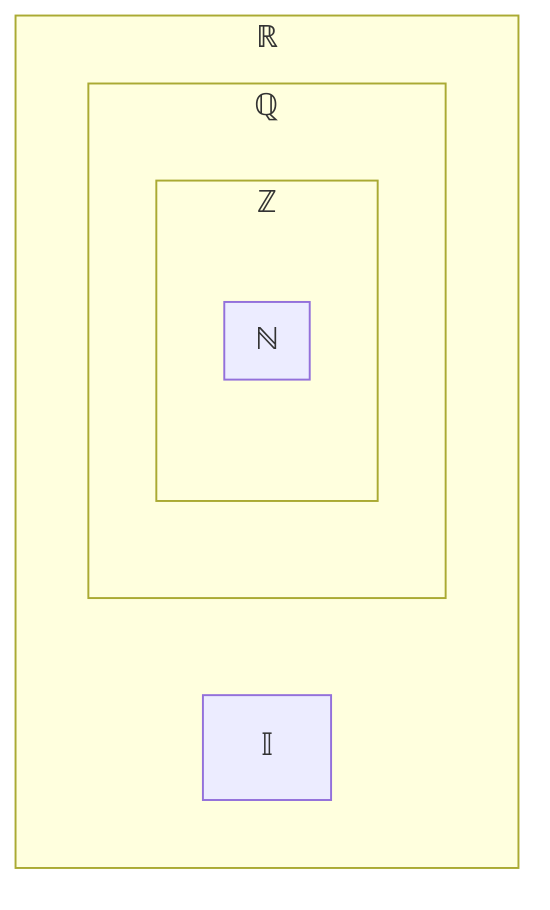

- [[0. Matemática Para Computação - Base|Back]]
> Conjuntos formam a base da matemática. Que da nome pra matemática
> Matemática se baseia em símbolos
---
# Conjuntos

- Conjunto
- Elemento 
- Relação de Pertinência
## Conjunto e Elemento

> Um **Conjunto** é um conceito primitivo que *Informalmente* pode ser entendido para uma _coleção_ **não ordenada** de entidades distintas, chamadas de **Elementos** do conjunto

- Pontos principais
	- É um conjunto, conglomerado
	- Não precisa ser ordenada
	- São chamadas de elementos 
- Pertencer é ver se o elemento esta dentro do conjunto
### Representação dos conjuntos

- Geralmente apelidamos o conjunto com alguma letra do alfabeto
- Temos letras reservadas como:
	- U - Letra do conjunto universo
	- Caracteristicas - Conjunto sempre tem abertura e fechamento de chave
	- Lembra a construção de um array
#### Exemplos:
- Citando um a um seus elementos:
$A = \{2, 4, 6, ...\}$

- Apresentando uma **Propriedade** característica:
$A = \{x | x$ é n° inteiro positivo par$\}$

> Em python podemos usar conjuntos, e o sinal é o mesmo para escrever normalmente na matemática -> A = {2, 4, 6}. Ele reconhece como `set`

## Relação de Pertinência

- Simbolo do pertence -> $\in$ 
- Simbolo do não pertence -> $\notin$
#### Exemplos:

Seja : A = {1, 2, 3, 4, 5}

$3 \in A$ ( 3 **pertence** a A )
$10 \notin A$ ( 10 **não pertence** a A )
## Inclusão de Conjuntos

> **Definição**: Um conjunto **A** é **subconjunto** de um conjunto **B** se, e somante se, **todo elemento** de **A é também** um elemento de **B**
- Conhecido como subconjunto, o ato de ter um conjunto dentro de outro conjunto
- Pode estar contido como também contém
$(\forall x)(x \in A \to x \in B)$
#### Exemplo:

- A = {1, 2};
- B = {1, 2, 3, 4, 5, 6 ,7, 8};
- C = {2, 4, 6, 8, 10};

$A \subset B$ (A é subconjunto de B)
      (A está contido em B)

- Está contido e é um subconjunto por todos os elementos do conjunto A estão em B

$C \nsubseteq B$ (C não é subconjunto de B)
      (C não está contido em B)

> Para mostrar ao contrário se B contém A, seria o simbolo $\supset$ 

## Exercícios

1. Complete os espaços com (V) verdadeiro ou (F) Falsas:

A = {1, 2, 3, 4}
B = {1, 3, 4} então:

a) $B \subset A$ (V)
b) $3 \in A$ (V)
c) $2 \notin B$ (V)
d) $\{1, 2\} \in A$ (F)
e) $\{1, 2\} \subset A$ (V)
f) $\{4\} \in A$ (F)

2. Complete os espaços com (V) ou (F):

A = {a, b, {a}, {a, b}}
B = {a, b, {a, b}}

a)$B \subset A$ (V)
b)$a \in A$ (V)
c)$b \notin B$ (F)
d)$\{a, b\} \in A$ (V)
e)$\{a, b\} \subset A$ (V)
f) $\{a\} \in A$ (V)

## Conjuntos Numéricos

- **Naturais**: $\mathbb{N}$ = {0, 1, 2, 3, 4, 5, ...}
- **Inteiros**: $\mathbb{Z}$ = {..., -3, -2, -1, 0, 1, 2, 3, ...}
- **Racionais**: $\mathbb{Q} = \{x | x = \frac {a} {b}\ ; a \in \mathbb{Z}, b \in \mathbb{Z}\ e\ b \ne 0\}$
- **Irracionais**: $\mathbb{I}$ 
	- Exemplos: 
		- $\pi$ = 3,141592...;
		- $e$ = 2,718281...;
		- $\sqrt{\smash[b]{2}}$ = 1,414213...;
- **Reais**: $\mathbb{R}$ = $\mathbb{Q}\ \bigcup\ \mathbb{I}$ 

## Igualdade

> Dois conjuntos A e B são iguais se, e somente se, têm os **mesmos elementos**.

- $A = B \Leftrightarrow A \subset\ e\ B \subset A$ ou 
- $A = B \Leftrightarrow (\forall) (x \in A \Leftrightarrow x \in B)$
#### Exemplo:
A = {0, 1, 2, 3}
B = {$x \in \mathbb{N}\ |\ x \leq 3$}
- Neste caso A = B, pois A $\subset$ B e B $\subset$ A.

## Conjunto Vazio

> Um conjunto sem elementos é chamado **conjunto vazio**.
> Representado por $\varnothing$ 
#### Exemplos: 
- A = {x | x é n° par compreendido entre 6 e 8}
- A = $\varnothing$, pois não existe n° par maior que 6 e menor que 8.

## Conjunto Universo:

> É o conjunto ao qual pertencem **todos os elementos** envolvidos em um determinado assunto ou estudo, e é simbolizado pela letra **U**.

- Conjunto universo é um conceito relativo, o conjunto universo U pode mudar de acordo com o contexto da situação em que estivermos trabalhando
#### Exemplos:
- Na **Matemática Discreta**: 
	$$U = IN\ ou\ U = \mathbb{R}$$
- No **Cálculo I**:
	$$I:\ U=IR$$
	
## Conjunto das Partes:
> **Definição**: Chama-se _Conjunto das partes_ de um conjunto A, e se indica $P(A)$, ao conjunto de todos os subconjuntos do conjunto A.
> É principalmente o Ato de encapsular o máximo de subconjuntos dentro de um conjunto. Para saber quantos subconjuntos é esperado dentro de um conjunto, devemos contar quantos itens temos dentro de um determinado conjunto, e fazer a conta $P(A) = 2^n$.
> Se $A = {a, b, c}$, Então o conjunto das partes de A é formado por: $$P(A) = \{\varnothing, \{a\}, \{b\}, \{c\} \{a, b\}, \{a, c\}, \{b, c\}, \{a, b, c\} \}$$Obs: Nesse caso o número de elementos de **P(A)** é igual a **8**, ou seja, $$n(P(A))=8$$ Por que no subconjunto de A temos $P(A) = 2^8$

##### Exemplo
Dar o número de elementos do conjunto das pastes de A, sendo: