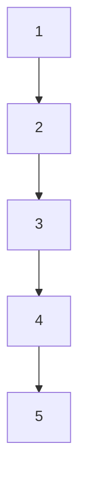
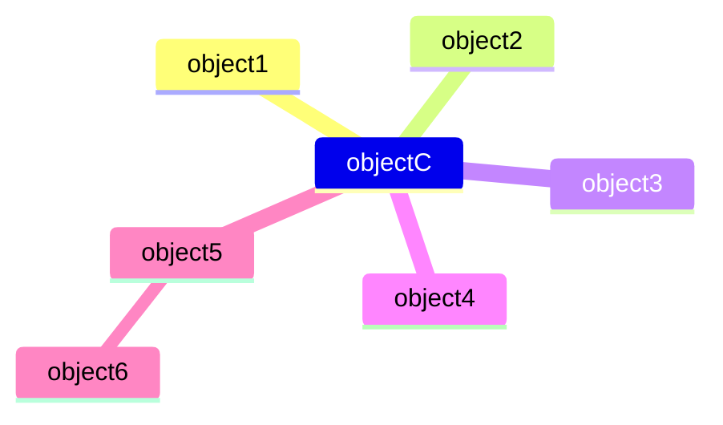

[[0. Técnicas de Programação - Base|Base]]
# Módulo 1
## Conhecendo a Tecnologia JAVA
### Objetivos
- Descrevendo conceitos chaves sobre a linguagem de programação JAVA
- Lista das 3 principais tecnologias JAVA
- Ciclo de vida de um software
### Como surgiu?
- Surgiu por volta de 1991
- Foi criada inicialmente para atender pequenos projetos eletrônicos, mas com dificuldades financeiras do setor, e principalmente com o surgimento da internet em 1993, passou a atuar nessa área
- Em 1995 a Sun anunciava Java como uma plataforma de desenvolvimento.
- Desde 1996 até os dias de hoje a linguagem java não para de crescer. Atualmente java invadiu celulares, pagers, PDA
### Características da Linguagem Java
- 100% Orientado a Objetos
- Portabilidade 
- Independente de Plataforma
- Multithreading
- Suporte a Comunicação
- Segurança
- Simples
- Acesso Remoto a Banco de dados
### Comparação Orientação a objeto com procedural

### Tecnologias incorporadas em Java
- RMI
- CORBA
- URL
### Simplicidade de Java
- Retira técnicas complicadas como ponteiros de C
- A possibilidade de reaproveitamento com classes 
- Retirada automática de classes e objetos não utilizados com o garbage colecctor
### Multithread
Processamento de varias tarefas ao mesmo tempo e não utilizando a maquina de quem utiliza o software, mas sim pela JVM (Maquina virtual do java)
### Seguro
- Proibe ponteiros
- Não lê e nem armazena dados no hard disk do usuário
- Verifica todo o código java para ver se contém apenas códigos validos
- Suporta assinaturas digitais
### Plataforma
Para criar um executável em outras linguagens, a cada sistema operacional que for rodar o sistema, é necessário o seu compilador, um diferente de cada sistema. 
O grande porém disso, é que como cada sistema tem um compilador, cada um pode interpretar e converter o código de alguma forma expecifica. Como em C, que usamos o gcc para compilar código C, mas existe o Pelles, que compila e contém outras bibliotecas que não tem no gcc. O que nos faz ter que gerenciar nossas compilações para cada sistema
# Grupo de Produtos Java
- Java 2 SE Platform (J2SE);
	- **Ideal Para:**
	- eCommerse;
	- eBusines
	- eLearning
- Java 2 Platform Enterprise Edition (J2EE);
	- **Ideal Para:**
	- Standard Aplications
	- Applets
- Java 2 Platform, Micro Edition (J2ME);
	- **Ideal para:**
	- Cell Phones
	- PDAs
	- Car navigation System
# Ciclo de Produção
## Análise
> É o processo de investigação de um problema que você quer resolver em um software. Enfoca o "o que" fazer e não se preocupa de "como fazer".

- Identificar o problema de forma clara
- Identifica componentes que deseja resolver
- Analisa os requisitos do cliente
- Determina o que deve ser feito
## Design
> É o processo que utiliza os dados da analise e inicia o desenvolvimento das telas do sistema

## Desenvolvimento
> Consiste em utilizar as telas dos sistemas e criar a programação de componentes para o sistema 

## Testes
> Consiste em testar cada componente do sistema individualmente. Valida se o desenvolvimento e o designer estão de acordo com a análise

## Implementação
> Nesta fase o software e testado e acompanhado do usuário final

## Manutenção
> Consiste em concertar falhas no software que irão aparecer após a implementação

## End - of - Life
> Após todos os testes e o software estiver de acordo com analise o software é concluído

