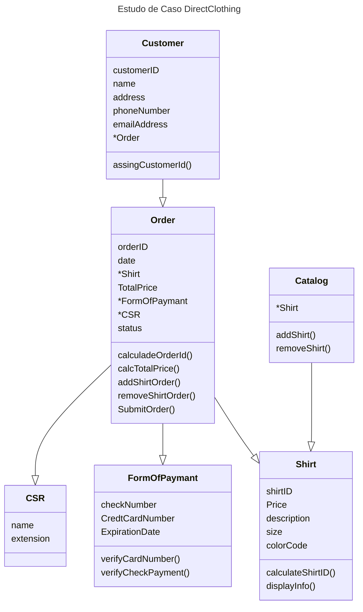

# Módulo 2
- Analisando um problema usando técnicas de analise de orientação a objetos
- Desenvolvendo classes para cada objeto analisado
- ---
# Contextualização
>  DirectClothing vende **Camisetas** através de um catalogo de produtos. A empresa está crescendo 30% por ano e necessita de um novo sistema de vendas. Você foi contratado através da DirectClothing para projetar o novo sistema.
>  DirectClothin publica um **Catalogo** de seus produtos a cada 6 meses e envia para seus **vendedores e funcionários**. Cada camisa no catálogo tem um identificador de produto (ID), um ou mais cores (Cada com um código de cor de diferente), um ou mais tamanhos, uma descrição e um preço
>  DirectClothin aceita cheques e a maioria dos cartões de crédito
>  Para fazer um **pedido**, o **cliente** pode ligar para a DirectClothing, e pedir um representante de vendas para tirar o pedido ou o cliente envia um fax de um impresso de encomendas da empresa através de seu Web Site.
>  DirectClothin gostaria de dar para seus clientes a opção de entrar com um pedido on-line, via internet. Os dados são estimados de acordo com o catalogo atual.
>  Na entrada de um pedido, verifica se um ou mais produtos são disponíveis para venda em estoque. Após a verificação se existe o produto pedido e verificado o pagamento, e logo após é enviado para o setor de entrega uma copia do pedido para que o produto seja entregue no endereço do cliente. Se caso o pedido for feito através do telefone, o vendedor preenche a ficha do pedido, que é feito o mesmo processo que se estivesse no sistema online

## Definindo o problema predominante
- Antes de começar a programar é ideal identificar objetos para a resolução dos problemas
- Os projetos começam definindo o domínio de problema juntando exigências de cliente e escrevendo uma contextualização. Através da contextualização, podemos identificar os objetos do sistema e modelando através da UML
### Identificando Objetos
- Objetos podem ser físicos ou conceituais
	- Uma conta de um cliente é um objeto conceitual
- Objetos possuem atributos (características)
	- Podemos definir para uma camiseta:
		- Cor
		- Tamanho
		- Modelo
		- Estilo
	- Para o cliente
		- Tamanho, 
		- nome,
		- Forma de pagamento,
		- email
		- telefone
- Os objetos possuem métodos, que são quem delimita o que esse objeto pode fazer como:
	- Mostrar valores
	- Calcular valores
	- Fazer ações
- Métodos geralmente afetam atributos. Por exemplo um objeto pode ter um método que receba alterações de modelo
### Convenção de nomes
- Objetos levam nomes substantivos: Camisa, Cliente...
- Atributos também recebem substantivos: Cor, tamanho...
- Métodos recebem verbos no infinitivo: mostrar, gravar...
### Critérios para Identificação de Objetos
- De acordo com o domínio do problema, devemos considerar os seguintes critérios
	- Relevância para o domínio do problema
	- Existência independente
### Relevância no Problema
- Para saber se um objeto existe relevância, ele deve responder as seguintes questões:
	- O objeto existe dentro do domínio do problema?
	- O objeto e requerido para uma solução completa?
	- O objeto é requerido como parte de uma interação entre um usuário e a solução?
### Existência Independente
- Para que um substantivo seja um objeto e não um atributo, ele tem que existir independente dentro do contexto do domínio. 
- Ele pode ter conexão com outros objetos mas pode existir independente
- No estudo da directclothing, temos cliente e pedido, que devem ser ligados porem ambos independentes 
### Estudo de Caso

