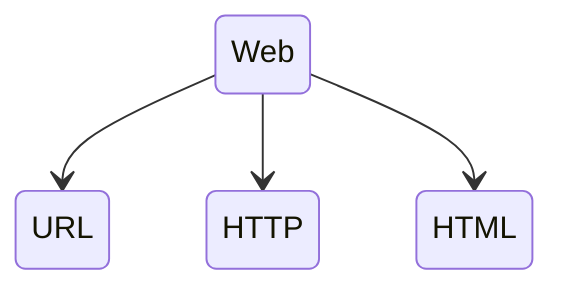

**Objetivos da aula**
> Criar uma base teórica sobre desenvolvimento web
> Apresentar o protocolo HTTP
> Introduzir os conceitos de APIs JSON
> Apresentar o OpenAPI
> Introduzir os schemas usando Pydantic
---
# A web

- Quando falamos de aplicações webm falamos de aplicações que funcionam em rede
- Rede essa que pode ser privada, domestica, empresarial ou até a internet
- Internet iniciada em 1960 e ja possui diversos padrões definidos e vem se aperfeiçoando 
- Quando se fala em comunicação em rede, falamos em comunicação de 2 mais computadores
## Modelo cliente-servidor

- No contexto da internet, a comunicação via rede se da entre um cliente e servidor
	- Cliente sendo qualquer aparelho que acesse a aplicação para uso como
	- Celular com um browser ou aplicativos que acessam a internet e requer dados de um servidor 
	- computadores da mesma forma que um celular, mas podendo até fazer outros tipos de papeis como cliente como o curl ou wget que consegue fazer requisições de forma diferente para um endpoint
	- E o servidor é um computador onde dispões de recursos que esses clientes podem acessar
- A comunicação é bidirecional. Um cliente faz uma requisição ao servidor, e o servidor emite uma resposta
	- Comunicação essa por meio de protocolos padronizados

> Para construir um servidor, precisamos de uma biblioteca que "sirva" nossa aplicação em python. Com o fastapi usamos o Uvicorn, o responsável por servir a aplicação

**Quando executamos**:
```bash
fastapi dev <caminho-arquivo-inicial.py>
```
- Faz uma chamada ao `uvicorn` e inicia um servidor loopback, acessivel apenas internamente pelo nosso computador. 
### Usando o fastapi na rede local

O uvivorn também pode servir FastAPI na rede local, fazendo o computador ser um total servidor da minha aplicação:
```bash
fastapi dev <caminho-arquivo-inicial.py> --host 0.0.0.0
```
> Esse caminho também poderia ser executado pelo taskipy que configuramos antes usando o comando `task run --host 0.0.0.0`

- Assim posso usar outro computador ou celular em minha rede local para acessar minha aplicação pelo ip da maquina que esta como host neste caso
> Descobrir o IP da máquina no terminal não é dificil, mas existe uma maneira de fazer isso pelo python utilizando seu terminal interativo:
```python
>>> import socket
>>> s = socket.socket(socket.AF_INET, socket.SOCK_DGRAM)
>>> s.connect(("8.8.8.8", 80))
>>> s.getsockname()[0]
'192.168.15.123'
```
> Socket é uma dependencia que ja vem com o python e ele nos da a possibilidade de fazer requisições e montar servidores HTTP sem precisar de um framework como fastapi. Porém é muito menos utilizado pois precisa escrever muito para conseguir ter algo que o fastapi ja consegue em uma linha só. O que pode não ser muito seguro também 
## O modelo padrão da web

- Os padrões principais padrões da internet são esses três:



- [URL](https://pt.wikipedia.org/wiki/URL): _Localizador Uniforme de Recursos_. Um endereço de rede pelo qual podemos nos comunicar com um computador na rede.
- [HTTP](https://pt.wikipedia.org/wiki/Hypertext_Transfer_Protocol): um protocolo que especifica como deve ocorrer a comunicação entre dispositivos.
- [HTML](https://pt.wikipedia.org/wiki/HTML): a linguagem usada para criar e estruturar páginas na web.
---
### URL
- Uniform Resource Locator é um endereço que nos ajuda a encontrar um recurso específico em uma rede
- Uma URL é composta por: 
	- `protocolo://endereço:porta/caminho/recurso?query_string#fragmento`

1. **Protocolo**: A primeira parte com o "://". O padrão da internet é o "http://" e o mais comum de se ver é o "https://". Esses protocolos definem como os dados serão trocados entre o cliente e o local onde o recurso está armazenado, seja na internet ou em rede local
2. **Endereço do Host**: Pode ser um endereço IP ou um endereço [DNS](https://pt.wikipedia.org/wiki/Sistema_de_Nomes_de_Dom%C3%ADnio) que é um servidor que mascara o IP dando nome
3. **Porta (opcional)**: Usada para direcionar sua solicitação ao serviço específico no dispositivo. Por padrão o protocolo http usa a porta **80** e https usa a porta **443** se não especificada
4. **Caminho**: Indica a localização do recurso no servidor ou dispositivo. Exemplo "192.168.15.123:8000/busca", `/busca` é o nome do recurso. Quando não especificado, o servidor responde com o recurso da raiz (`/`)

> Quando acessamos `http://127.0.0.1:8000`, estamos acessando o servidor via protocolo http, no endereço do nosso próprio computador, na porta 8000 solicitando recursos do caminho `/`

#### HTTP

- Quando o cliente faz uma requisição para um endereço na rede, isso é feito via um protocolo e é direcionado ao servidor de recurso. Esse protocolo é o http ou sua versão segura https
- HTTP - Hypertext Tranfer Protocol (Protocolo de Transferência de Hipertexto)
- Fundamental da web para a comunicação entre cliente e servidores
- Baseado no modelo de requisição-resposta
##### Mensagens
- No contexto do HTTP, tanto requisição quanto respostas são chamadas de **mensagens**
- Exemplo das mensagens HTTP na versão 1:
```bash
GET / HTTP/1.1
Accept: */*
Accept-Encoding: gzip, deflate
Connection: keep-alive
Host: 127.0.0.1:8000
User-Agent: HTTPie/3.2.2
```
> Na primeira linha, temos o [verbo](https://fastapidozero.dunossauro.com/estavel/02/#verbos) GET, que solicita um recurso, neste caso, o recurso é `/`. As linhas seguintes compõem o [cabeçalho](https://fastapidozero.dunossauro.com/estavel/02/#cabecalho) da mensagem. Elas informam que o cliente aceita qualquer tipo de resposta (`Accept: */*`), indicam a URL destino (`Host: 127.0.0.1:8000`) e identificam o cliente que gerou a requisição (`User-Agent: HTTPie/3.2.2`), que neste caso foi o cliente [HTTPie](https://httpie.io/cli).

- A resposta do servidor foi o seguinte:
```bash
HTTP/1.1 200 OK
content-length: 24
content-type: application/json
date: Fri, 19 Jan 2024 04:05:50 GMT
server: uvicorn

{
    "message": "Olá mundo"
}
```
> Aqui, na primeira linha da resposta, temos a versão do protocolo HTTP utilizada e o [código de resposta](https://fastapidozero.dunossauro.com/estavel/02/#codigos-de-resposta) `200 OK`, indicando que a requisição foi bem-sucedida. O cabeçalho da resposta inclui informações como o `content-length` e `content-type`, que especificam o tamanho e o tipo do conteúdo da resposta, respectivamente. A data e o servidor que processou a requisição também são indicados. Finalmente, o [corpo da resposta](https://fastapidozero.dunossauro.com/estavel/02/#corpo), formatado em JSON, contém a mensagem `"Olá mundo"`.
###### Cabeçalho
> O cabeçalho de uma mensagem HTTP contém metadados essenciais sobre a requisição ou resposta. São:
- **Content-Type** -> Especifica o tipo de mídia no corpo da mensagem
	- `Content-Type: application/json` -> Para a mensagem em formato JSON
	- `Content-Type: text/html` -> Para a mensagem em formato HTML
- **Authorization**: Usado para a autenticação, como tokens ou credenciais
- **Accept**: Especifica o tipo de mídia que o cliente aceita
- **Server**: Fornece informações sobre o software do servidor
###### Corpo
> O corpo da mensagem contém os dados propriamente ditos, variando conforme o tipo de mídia. Exemplos podem incluir um objeto JSON ou uma estrutura HTML.

##### Verbos
> Quando um cliente faz uma requisição HTTP, ele indica sua intenção ao servidor utilizando verbos. Estes verbos sinalizam diferentes ações no protocolo HTTP. Vejamos alguns exemplos:

- **GET**: utilizado para recuperar recursos. Empregamos este verbo quando queremos solicitar um dado já existente no servidor.
- **POST**: permite criar um novo recurso. Por exemplo, enviar dados para registrar um novo usuário.
- **PUT**: Atualiza um recurso existente. Como, por exemplo, atualizar as informações de um usuário existente.
- **DELETE**: Exclui um recurso. Por exemplo, remover um usuário específico do sistema.

```python
@app.get('/')
def read_root():
    return {'message': 'Olá Mundo!'}
```
##### Código de Resposta
> No mundo das requisições usando o protocolo HTTP, além da resposta obtida quando nos comunicamos com o servidor, também recebemos um código de resposta (_status code_). Os códigos são formas de mostrar ao cliente como o servidor lidou com a sua requisição. Os códigos são divididos em classes e as classes são distribuídas por centenas:

- 1xx: informativo — utilizada para enviar informações para o cliente de que sua requisição foi recebida e está sendo processada.
- 2xx: sucesso — Indica que a requisição foi bem-sucedida (por exemplo, 200 OK, 201 Created).
- 3xx: redirecionamento — Informa que mais ações são necessárias para completar a requisição (por exemplo, 301 Moved Permanently, 302 Found).
- 4xx: erro no **cliente** — Significa que houve um erro na requisição feita pelo cliente (por exemplo, 400 Bad Request, 404 Not Found).
- 5xx: erro no **servidor** — Indica um erro no servidor ao processar a requisição válida do cliente (por exemplo, 500 Internal Server Error, 503 Service Unavailable).
---
> Para mais informações temos a documentação do [iana](https://www.iana.org/assignments/http-status-codes/http-status-codes.xhtml)
---
- Numa requisição sempre tem um código de resposta
- No código de teste que fiz, tem uma validação de status code 
```python
def test_root_deve_retornar_ok():
    client = TestClient(app)

    response = client.get('/')

    assert response.status_code == HTTPStatus.OK
```
> Nesse caso o status code não esta claro, mas esta passado como um estado do status como OK, o que será valido se retornar 200 ou qqr um na linha dos 200. Mas se quisermos uma garantia maior de que o status que precisa ser avaliado é o código 200, podemos passar ele no lugar do `HTTPStatus.OK` passando o numero 200. Mas não é convencionado, pois se recebermos 209? possivelmente não seja claro o seu significado

- A boa prática para lidar com status code é usar a classe http.HTTPStatus, pois ele ja mapeia todos os status code num objeto único. O que faz o teste ficar mais simples
##### O lado do servidor
Para garantir que a resposta obtida pelo cliente seja considerada um sucesso, o FastAPI, por padrão, envia o código de sucesso `200` para o método GET. No entanto, também podemos deixar isso explícito na definição da rota:
```python
@app.get('/', status_code=HTTPStatus.OK)
def read_root():
    return {'message': 'Olá Mundo!'}
```
### HTML
> O terceiro pilar fundamental da web é o _Hypertext Markup Language_, mais conhecido como HTML

- Uma linguagem de marcação
- O que vemos renderizado em uma página da web, é a interpretação do HTML
- A linguagem usa tags para definir a estrutura e o conteúdo de uma página web
- Para utilizar uma apresentação de Resposta de um HTML, podemos usar a classe `HTMLResponse`
```python
from fastapi import FastAPI
from fastapi.responses import HTMLResponse

app = FastAPI()


@app.get('/', response_class=HTMLResponse)
def read_root():
    return """
    <html>
      <head>
        <title> Nosso olá mundo!</title>
      </head>
      <body>
        <h1> Olá Mundo </h1>
      </body>
    </html>"""
```
### APIs
> APIs é a camada que não envolve visualização como o HTML, geralmente usamos o JSON para essa comunicação

- **API** -> Application Programming Interface
- Projetada para ser uma interface claramente definida e documentada, que facilita a interação por meio do protocolo HTTP
- Essencialmente, APIs reside no modelo cliente-servidor, onde o cliente troca dados com o servidor através de um [_endpoints_](https://fastapidozero.dunossauro.com/estavel/02/#endpoint)
#### Endpoints
> O termo refere-se a um ponto específico em uma API para onde as requisições são enviadas

- Cada endpoint está associada a uma função específica da API
	- Como recuperar dados, atualizar ou deletar dados existentes.
- Em minha aplicação tenho apenas 1 endpoint disponível que é o `/forms`
```python
@app.get('/')
def read_root():
    return {'message': 'Olá Mundo!'}
```
> Quando usamos o decorador `@app.get('/')`, estamos instruindo a nossa API que, para chamadas de método `GET` no endpoint `/`, a função a ser executada é `read_root`. O resultado da minha função por enquanto é uma chamada ao template da página de formulário via jinja2

## Documentação
> A documentação de uma API serve como um guia ou um manual, facilitando o entendimento e a utilização por desenvolvedores e usuários finais. Ela desempenha um papel crucial ao:

- Definir claramente os endpoints e suas funcionalidades.
- Especificar os métodos HTTP suportados (GET, POST, PUT, DELETE, etc.).
- Descrever os parâmetros esperados em requisições e respostas.
- Fornecer exemplos de requisições e respostas para facilitar o entendimento
### OpenAPI e documentação automática
[Documentação OpenAPI Specification](https://swagger.io/specification/)
- As especificações delimitada pela OpenAPI fornece um padrão robusto para descrever APIs,
- A utilização garante não apenas uma documentação, mas uma documentação confiável, testável de forma automática, simplifica o processo de documentação. Garantindo a consistência na precisão
- Temos aplicações como [Swagger UI](https://swagger.io/tools/swagger-ui/) e [Redoc](https://redocly.github.io/redoc/) que são amplamente usadas para uma visualização interativa numa interface fácil de navegar. 
- Nessas aplicações, conseguimos não só olhar e ler o que esta acontecendo nas rotas, como podemos testar cada uma delas diretamente nessas interfaces
- No fastapi o suporte a essas documentações interativas é automático.
---
> Para acessar o **Swagger UI** basta utilizar a rota `/docs` que ja vem especificada no cabeçalho da execução do `fastapi dev <nome-aplicação.py>`
```bash
 server   Server started at http://127.0.0.1:8000
 server   Documentation at http://127.0.0.1:8000/docs
```
> Para acessar o **Redoc** basta utilizar a rota `/redoc`. Essa rota já não vem especificada no prompt, mas também é disponível automaticamente
> A ideia do Redoc é ser mais legivel. Organiza a documentação de uma maneira mais linear e de fácil leitura. Destaca as descrições dos endpoints, métodos HTTP disponíveis, os schemas dos dados de entrada e saída e exemplos de requisições e resposta
---
## Trafegando JSON
> Objetivo é transmitir dados de forma agnóstica para diferentes tipos de clientes. Neste contexto o JSON se tornou a mídia padrão, graças à sua leveza e facilidade de leitura tanto por humanos quanto por máquinas.

- JSOM é aprecisado por sua simplicidade
- Apresentação dos dados como dicionário (chave:valor)
- Valores podem ser strings, números, booleanos, arrays entre outras

**Exemplo de um json**
```json
{
    "livros": [
        {
            "titulo": "O apanhador no campo de centeio",
            "autor": "J.D. Salinger",
            "ano": 1945,
            "disponivel": false
        },
        {
            "titulo": "O mestre e a margarida",
            "autor": "Mikhail Bulgákov",
            "ano": 1966,
            "disponivel": true
        }
    ]
}
```
> Exemplo apresenta a simplicidade e eficacia do JSON, tornando-o ideal para a comunicação de dados em uma ampla variedade de aplicações
### Contratos em APIs JSON
> Quando falamos sobre o compartilhamento de JSON entre cliente e servidor, é crucial estabelecer um entendimento mútuo sobre a estrutura dos dados que serão trocados. A este entendimento, denominamos **_schema_**, que atua como um contrato definindo a forma e o conteúdo dos dados trafegados.

O schema de uma API desempenha um papel fundamental ao assegurar que ambos, cliente e servidor, estejam alinhados quanto à estrutura dos dados. Este "contrato" especifica:

- Campos de Dados Esperados: quais campos são esperados na mensagem JSON, incluindo nomes de campos e tipos de dados (como strings, números, booleanos).
- Restrições Adicionais: como validações para tamanhos de strings, formatos de números e outros tipos de validação de dados.
- Estrutura de Objetos Aninhados: como os objetos são estruturados dentro do JSON, incluindo arrays e sub-objetos.

Um exemplo de uma simples mensagem de "Olá mundo" teriamos um schema assim:
```json
{
  "type": "object",
  "properties": {
    "message": {
      "type": "string"
    }
  },
  "required": ["message"]
}
```
> Onde estamos dizendo ao cliente que ao chamar a API, será retornado um objeto, esse objeto contém a propriedade `"message"`, a mensagem será do tipo `string`. Ao final, vemos que o campo `message` é requerido. Isso quer dizer que ele sempre será enviado na resposta.

#### Pydantic
> Biblioteca do ecossistema Python especializada na criação de schemas de dados e na validação de tipos

Esse mesmo esquema passado acima por json, no pydantic seria assim:
```python
from pydantic import BaseModel


class Message(BaseModel):
    message: str
```

- Essa é uma ferramenta python essencial para a validação de dados e na geração de documentação automátidca para APIs, como a documentação OpensAPI

##### Integração no FastAPI
- Para integrar, passamos uma especificação no campo `responde_model` do decorador do endpoint. 
- No meu projeto ficou assim:
```python
from http import HTTPStatus

from fastapi import FastAPI

from fast_zero.schemas import Message

app = FastAPI()


@app.get('/', status_code=HTTPStatus.OK, response_model=Message)
def read_root():
    return {'message': 'Olá Mundo!'}
```
> Com isso já é possivel ver uma parte a mais com o Schema no swagger e exemplo de valores dentro do endpoint no swagger

- Agora temos um exemplo claro da saída esperada do endpoint, um objeto JSON que especifica que o campo "message" será retornado um valor do tipo "string"

# Conclusão
- Nesta aula vi um pouco mais sobre as principais comunicação da web, e formas de resposta com json e HTML. 
- Apesar do HTML ser a base de toda apresentação na web, o curso focara em respostas json, pois é o que há de mais comum
- Vi também uma introdução e entendimento maior das ferramentas apresentadas neste curso. O fastapi e o pydantic são os personagens principais deste curso.
- Com isso também pude ver um pouquinho mais sobre a geração de documentação que fica na rota `\docs` das rotas do fastapi que é o swagger UI, o mais utilizado no mercado para validação e testes dos endpoints
- Com essa aula, tive uma introdução para que eu possa entender como construir APIs em qualquer framework ou linguagem. 